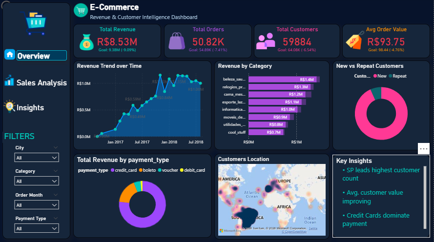
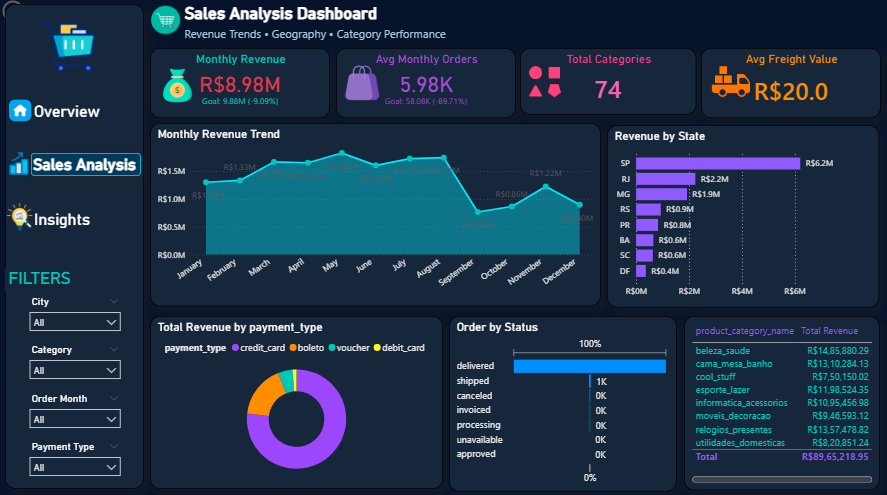
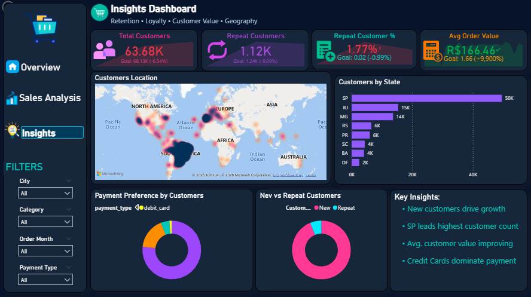

# E-Commerce Revenue & Customer Intelligence Dashboard

## Project Overview

Built an end-to-end Business Intelligence project using SQL + Power BI to analyze e-commerce revenue, customer behavior, payment trends, category performance, and regional insights.

## Dataset

Source: Brazilian E-Commerce Public Dataset (Kaggle).

The raw dataset is publicly available from the original source and has not been uploaded to this repository to keep the project lightweight and organized.

## Tools Used

* PostgreSQL / SQL
* Power BI
* Data Modeling
* DAX Measures

## Dashboard Pages

### 1. Executive Overview

* Revenue KPIs
* Orders & Customers
* Revenue Trend
* Category Performance
* Payment Analysis

### 2. Sales Analysis

* Monthly Revenue Trend
* Revenue by State
* Freight Analysis
* Order Status
* Top Categories

### 3. Customer Insights

* Repeat Customers
* Customer Geography
* Payment Preference
* Retention Analysis

## Key Skills Demonstrated

* SQL Joins & CTEs
* Data Cleaning
* KPI Development
* Dashboard Design
* Business Storytelling

## Screenshots

## Screenshots

### Overview Dashboard

### Sales Analysis Dashboard

### Customer Insights Dashboard

